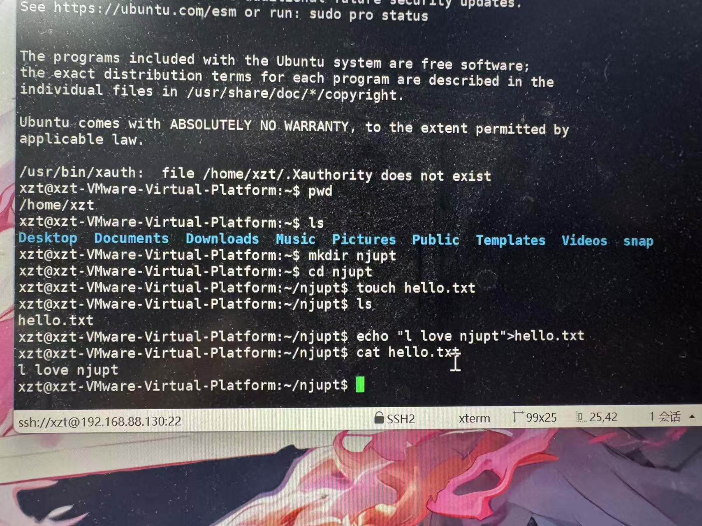

# VMware 虚拟机创建与 Xshell 远程连接实验记录

## 一、实验目的

使用 VMware 创建 Ubuntu 虚拟机，并通过 Xshell 以 SSH 方式远程连接到该虚拟机，完成基本的 Linux 命令操作。

## 二、虚拟机创建

1. 打开 VMware，新建一台虚拟机。
2. 选择 Ubuntu 作为客户机操作系统，完成处理器、内存、磁盘等基础配置。
3. 安装并启动 Ubuntu 系统。
4. 配置虚拟机网络，确保主机与虚拟机之间能够正常通信。
5. 在 Ubuntu 中启用 SSH 服务，使虚拟机可以接受远程登录。

## 三、使用 Xshell 远程连接

1. 在 Windows 主机上打开 Xshell，新建会话。
2. 将协议选择为 **SSH**，端口设置为 **22**。
3. 输入虚拟机 IP 地址 `192.168.88.130`，并使用 Ubuntu 用户 `xzt` 登录。
4. 连接成功后，即可在 Xshell 终端中远程操作 VMware 中的 Ubuntu 虚拟机。

## 四、远程操作验证

连接成功后，我在远程终端中完成了以下操作：

```bash
pwd                 # 查看当前目录
ls                  # 查看目录内容
mkdir njupt         # 创建 njupt 目录
cd njupt            # 进入该目录
touch hello.txt     # 创建 hello.txt 文件
echo "I love njupt" > hello.txt
cat hello.txt       # 查看文件内容
```

终端成功显示 `I love njupt`，说明已通过 Xshell 成功远程连接并操作 Ubuntu 虚拟机。

## 五、实验截图

下图显示了 Xshell 已通过 SSH 连接到 `192.168.88.130:22`，并在远程 Ubuntu 系统中创建、写入和查看 `hello.txt` 文件的过程。



## 六、实验结论

本次实验成功完成了 VMware 虚拟机的创建、Ubuntu 系统部署以及 Xshell 的 SSH 远程连接。通过远程终端执行目录与文件操作，验证了主机能够稳定地管理虚拟机中的 Linux 系统。
