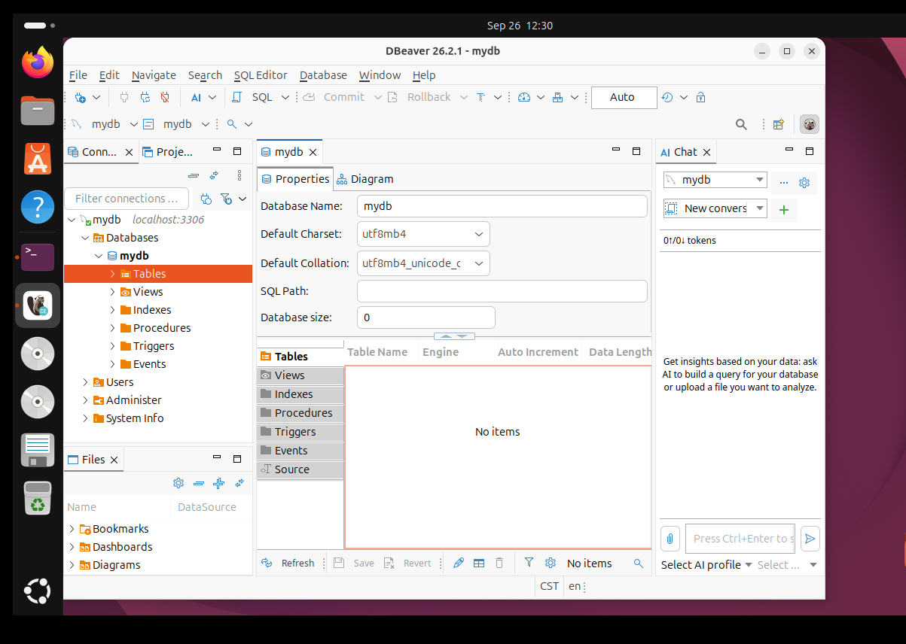

# Ubuntu 搭建 MySQL 服务器实验报告

## 一、实验目的

在 Ubuntu 虚拟机中安装 MySQL 服务器，创建数据库和数据库用户，设置访问权限，并使用 DBeaver 图形化工具连接数据库，完成数据库搭建与连接验证。

## 二、实验环境

| 项目 | 实验环境 |
| --- | --- |
| 宿主机 | Windows |
| 虚拟化软件 | VMware |
| 虚拟机操作系统 | Ubuntu |
| 远程终端工具 | Xshell |
| 数据库服务 | MySQL |
| 数据库管理工具 | DBeaver Community |
| 数据库名称 | `mydb` |
| 数据库用户 | `myuser@localhost` |
| 连接地址与端口 | `localhost:3306` |

安装和配置命令在 Ubuntu 终端中执行，也可以通过 Xshell 连接 Ubuntu 后执行。DBeaver 在 VMware 中的 Ubuntu 图形桌面内启动。

## 三、实验步骤

### 1. 切换到管理员用户

打开 Ubuntu 终端或连接 Xshell，输入：

```bash
sudo su root
```

按提示输入 Ubuntu 用户的登录密码，进入管理员命令行。终端输入密码时不显示字符。

### 2. 安装 MySQL 服务器

先更新软件包索引，再安装 MySQL：

```bash
apt update
apt install mysql-server
```

安装过程中如提示是否继续，输入 `Y` 并回车，等待安装完成。

### 3. 查看 MySQL 服务状态

```bash
systemctl status mysql
```

状态中显示 `active (running)` 表示服务正在运行。按 `q` 返回命令行。

如果服务没有启动，可以执行：

```bash
systemctl start mysql
```

### 4. 进入 MySQL 并创建数据库

在管理员命令行中输入：

```bash
mysql
```

出现 `mysql>` 提示符后，逐条执行以下 SQL。命令末尾使用英文分号，不需要输入课件中的 `>` 提示符。

#### （1）创建数据库

```sql
CREATE DATABASE mydb CHARACTER SET utf8mb4 COLLATE utf8mb4_unicode_ci;
```

该命令创建名为 `mydb` 的数据库，指定字符集为 `utf8mb4`，排序规则为 `utf8mb4_unicode_ci`。

#### （2）创建数据库用户

```sql
CREATE USER 'myuser'@'localhost' IDENTIFIED BY '111111';
```

按课件要求创建用户 `myuser`，密码为 `111111`，允许该账号从本机连接数据库。这里的密码属于 MySQL 用户，与 Ubuntu 登录密码是两回事。

> `111111` 为课件中的实验示例密码。如果当前密码策略拒绝该密码，应设置符合策略的密码，并在 DBeaver 中填写相同的密码。

#### （3）授予数据库权限

```sql
GRANT ALL PRIVILEGES ON mydb.* TO 'myuser'@'localhost';
```

该命令授予 `myuser` 对 `mydb` 数据库中对象的全部权限，授权范围为 `mydb`。

#### （4）刷新权限

```sql
FLUSH PRIVILEGES;
```

按课件顺序执行权限刷新。使用上述 `CREATE USER` 和 `GRANT` 语句时，相关更改本身即生效。

#### （5）查看数据库

```sql
SHOW DATABASES;
```

检查输出列表中是否存在 `mydb`，以确认数据库已创建。

#### （6）退出 MySQL

```sql
exit;
```

执行后回到 Ubuntu 命令行。

### 5. 安装并启动 DBeaver

在管理员命令行中执行：

```bash
snap install dbeaver-ce --classic
```

其中 `--classic` 前面是两个英文短横线。等待安装结束后，输入以下命令退出管理员身份：

```bash
exit
```

打开 VMware 中的 Ubuntu 图形桌面，使用普通用户登录。在桌面终端中执行：

```bash
snap run dbeaver-ce
```

本次操作中曾出现 DBeaver 白屏。关闭原窗口后，在 Ubuntu 桌面终端改用以下命令启动，随后界面能够正常显示：

```bash
GDK_BACKEND=x11 snap run dbeaver-ce
```

此设置只作用于本次启动。普通 Xshell 命令行连接不会直接显示 DBeaver 图形窗口。

### 6. 配置数据库连接

在 DBeaver 中选择 **Database（数据库）→ New Database Connection（新建数据库连接）**，选择 **MySQL**，填写以下参数：

| 配置项 | 配置内容 |
| --- | --- |
| Host（主机） | `localhost` |
| Port（端口） | `3306` |
| Database（数据库） | `mydb` |
| Username（用户名） | `myuser` |
| Password（密码） | `111111`，或创建用户时实际设置的密码 |

点击 **Test Connection（测试连接）**。首次连接如提示下载驱动，按提示完成下载。出现 `Connected` 后，点击 **OK** 关闭测试提示，再点击连接配置窗口中的 **OK** 或 **Finish** 保存。

本次连接中曾出现 `Access denied for user 'root'@'localhost'`，原因是连接配置使用了 `root` 账号。将用户名改为课件要求的 `myuser` 并填写对应密码后，连接测试成功。

由于 DBeaver 和 MySQL 都运行在同一台 Ubuntu 虚拟机中，本实验使用 `localhost` 连接，无需配置 SSH 隧道。课件末尾提到的 Windows 直接远程连接不属于本次操作范围。

### 7. 查看数据库

在 DBeaver 左侧数据库导航器中依次展开：

```text
mydb 连接（localhost:3306）
└── Databases
    └── mydb
        └── Tables
```

打开 `mydb` 的属性页面，查看数据库名称、默认字符集和对象列表。

## 四、实验结果

MySQL 数据库连接成功，DBeaver 能够显示 `mydb` 数据库及其属性。以下为本次实验的实际操作截图（用户提供的图一）：



*图1　DBeaver 中的 mydb 数据库及属性页面*

从截图中可以看到：

- 左侧连接地址为 `localhost:3306`，数据库列表中存在 `mydb`。
- 属性页面中的数据库名称为 `mydb`，默认字符集为 `utf8mb4`。
- 数据库下可以查看 Tables、Views、Indexes、Procedures 等对象分类。
- 表列表显示 `No items`，符合本次只创建数据库、尚未创建数据表的操作结果。

## 五、实验总结

本次实验完成了 Ubuntu 环境下 MySQL 服务器的安装、数据库 `mydb` 的创建、用户 `myuser` 的创建与授权，以及 DBeaver 的安装和本地连接。通过连接测试与数据库属性页面，确认数据库能够被图形化管理工具访问，达到课件要求的基本实验目标。

操作过程中需要区分 Ubuntu 系统用户与 MySQL 数据库用户，也需要区分 Xshell 远程命令行与 Ubuntu 图形桌面。关闭 Xshell 只会断开远程会话，已安装的软件和已保存的数据库仍保留在虚拟机中。
