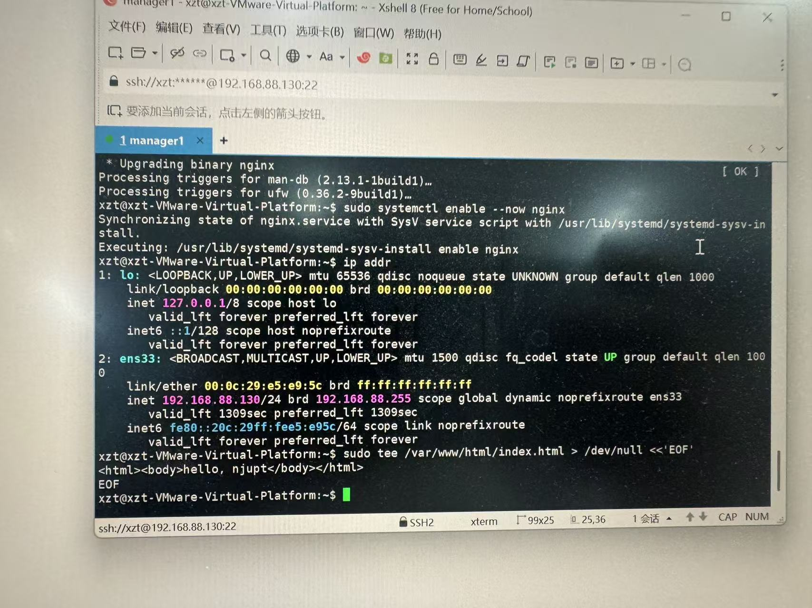
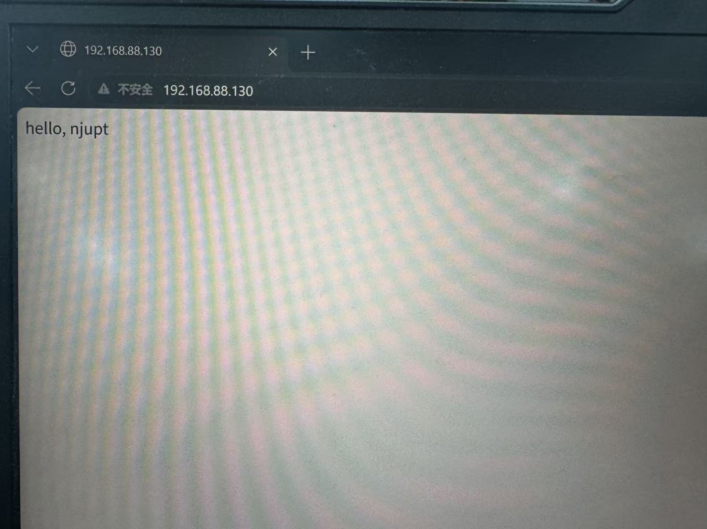

# Nginx 服务器搭建与浏览器访问

## 实验目标

在 Ubuntu 虚拟机中安装 Nginx Web 服务器，获取虚拟机 IP 地址，修改网页内容，并在 Windows 浏览器中访问该网页。

## 安装与启动 Nginx

我通过 Xshell 连接到 Ubuntu 虚拟机，执行以下命令安装 Nginx：

```bash
sudo apt update
sudo apt install nginx -y
```

安装完成后，启动 Nginx 服务并设置为开机自启：

```bash
sudo systemctl enable --now nginx
```

使用以下命令查看虚拟机的 IP 地址：

```bash
ip addr
```

在网卡 `ens33` 的信息中，可以看到虚拟机 IP 为 `192.168.88.130`。



## 修改网页显示的文本

Nginx 默认网页文件位于 `/var/www/html/index.html`。我执行以下命令，将网页内容改为 `hello, njupt`：

```bash
sudo tee /var/www/html/index.html > /dev/null <<'EOF'
<html><body>hello, njupt</body></html>
EOF
```

修改完成后，Nginx 会自动读取新的网页文件，无需重新启动服务。

## 在浏览器中访问

在 Windows 浏览器地址栏输入虚拟机的 IP 地址：

```text
http://192.168.88.130
```

浏览器成功显示 `hello, njupt`，说明 Nginx 服务器已经搭建成功，并且 Windows 可以访问虚拟机中的网页。



## 实验结果

我成功完成了 Nginx Web 服务器的安装与启动，修改了默认网页的内容，并通过 Windows 浏览器访问 `192.168.88.130`，验证网页能够正常显示 `hello, njupt`。
